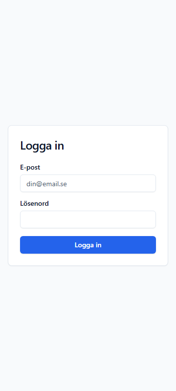
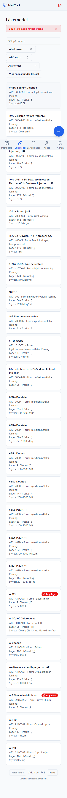
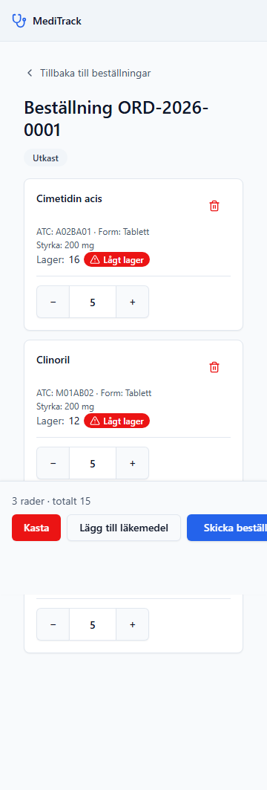
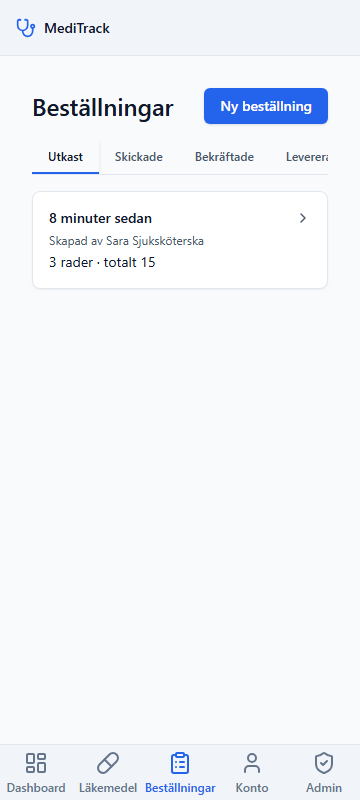
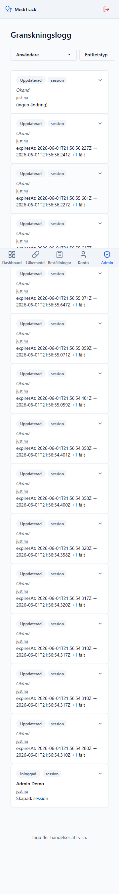
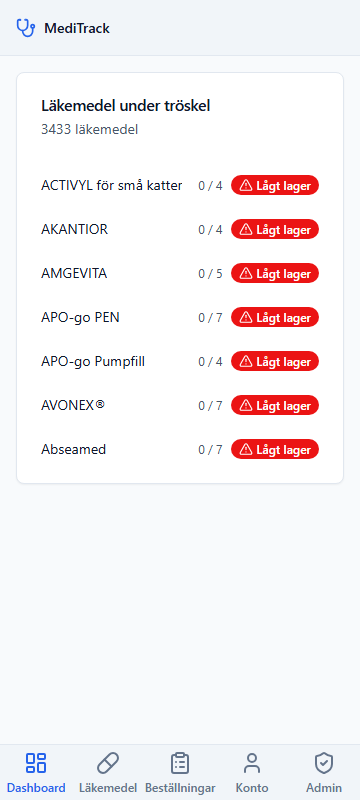

# MediTrack

> README är på svenska. UI-strängar citeras ordagrant i kodfont (t.ex. `Hämta AI-förslag`, `Utkast / Skickad / Bekräftad / Levererad`); tekniska egennamn som `AsyncLocalStorage`, `$extends`, `meditrack_app`, `tool_use` och `claude-haiku-4-5` lämnas i ursprungsform inom kodfont.

## Innehåll

- [Vad är det här?](#vad-är-det-här)
- [Arkitekturval (motivera dina val)](#arkitekturval-motivera-dina-val)
- [Snabbstart med Docker Compose](#snabbstart-med-docker-compose)
- [Demo-konton](#demo-konton)
- [Demo-rundtur (5 minuter)](#demo-rundtur-5-minuter)
- [Lokal utveckling utan Docker](#lokal-utveckling-utan-docker)
- [Tester](#tester)
- [Mobil-först verifiering](#mobil-först-verifiering)
- [Kända luckor](#kända-luckor)
- [Med mer tid](#med-mer-tid)
- [§6-svar (intervjudiskussion)](#6-svar-intervjudiskussion)
- [Vad ligger var?](#vad-ligger-var)

---

## Vad är det här?

Internt webbverktyg på svenska för **vårdenheter** att hantera läkemedelslager
och beställningar — sjuksköterskor, apotekare och administratörer ser aktuellt
lagersaldo, lägger flerradsbeställningar och följer status `Utkast → Skickad
→ Bekräftad → Levererad`, med varning när ett läkemedel går under sin
tröskel. Ersätter dagens felbenägna listor och e-postbeställningar.

Levereras som Medovias case för mid-level fullstack-intervjun (en veckas
tidsbudget).

## Arkitekturval (motivera dina val)

Nedan sammanfattas varje teknikval i en skanbar tabell — varför vi valde det vi
valde, vad vi övervägde, och vad valet kostade oss att välja annorlunda. Tre
beslutsområden djupas efter tabellen: de som direkt svarar på intervjufrågorna
i §6.

| Val | Alternativ övervägda | Varför vi valde så | Följdeffekt |
|-----|----------------------|--------------------|-------------|
| **Frontend** — TS + React | Vue 3 + TS, Svelte+Kit, Next.js, Remix | Låst av användaren; matchar Medovias interna stack; React + Vite ger snabbaste utvecklingsloop på en veckas tidsbudget | shadcn/ui-komponenter, TanStack Query för server-state, react-hook-form + Zod för formulärvalidering |
| **Backend** — Node.js + Fastify + TS | Express, NestJS, Go (Gin/Echo), Ruby on Rails | Samma språk över FE+BE → delade Zod-kontrakt; Fastify är TS-native, snabbare än Express, har plugin-arkitektur som matchade `@fastify/rate-limit` + `@fastify/cookie` rent | File-per-endpoint route-mönster (D-65); plugin-baserad request-context (D-92); auth + rate-limit + audit som plugins |
| **Database** — PostgreSQL 16 | MySQL 8, SQLite, MongoDB | Domänen är obestridligt relationell; `SELECT ... FOR UPDATE` ger ett verkligt svar på §6-frågan om två samtidiga beställningar | Phase 4 D-79 CUM-batch lock; Phase 5 named-role split; `pg_trgm` GIN-index för fritextsökning (Phase 2 CR-02) |
| **ORM** — Prisma 5 | Drizzle, Kysely, TypeORM, raw SQL | Schema-first migrationer; genererade TS-typer; `$extends` typed extensions möjliggjorde Phase 5 audit-middleware utan att röra service-koden | Audit via `$extends` (D-90..D-97); migrationer i Git-historiken berättar datamodellens historia |
| **Server-state** — TanStack Query 5 | Redux Toolkit, SWR, Zustand, Apollo | Server-state är fundamentalt async; cache-key + invalidations + refetch-on-focus löser låg-lager-banner-uppdatering i Phase 6 utan en client-state-store | D-69 query-key-konventioner; D-119 sibling-invalidations; D-105 `useInfiniteQuery` för audit-paginering |
| **UI-kit** — shadcn/ui + Tailwind CSS 4 | MUI, Chakra, Mantine, Ant Design | shadcn ger kopierade komponenter i koden (ingen runtime-dep), Tailwind ger mobil-först responsivitet i klassnamn; matchar brief-§3.2 "responsivt UI" utan en custom-CSS-budget | Phase 1 UI-SPEC (slate + new-york), touch-targets ≥44 px; Combobox + Sheet + Dialog + Tabs återanvänds över alla 6 sidor |
| **Tester** — Vitest 2 | Jest, Mocha + Chai, Node:test | Vite-native (delar config med apps/web); Fastify `app.inject` mot riktig Postgres ger integrationstest utan att starta en server | Plan 05-03 har 17 audit-integration-tester; Plan 04 har 7 deliver-tester inkl. `pg_locks`-bevis; Plan 06 har 5 AI + 3 dashboard-integration-tester |
| **Monorepo** — pnpm workspaces 9 | Nx, Turborepo, npm + Lerna, plain folders | Inga extra config-filer; `pnpm -r` räcker för parallella scripts; symlinks för `@meditrack/shared` ger typedelning utan publicering | `apps/api`, `apps/web`, `packages/shared`; root `pnpm verify` kör hela suiten på ett kommando (D-129) |
| **Container** — Docker Compose v2 | Kubernetes, Podman Compose, Vagrant, devcontainers | Brief §3.3 nämner explicit "ett plus"; ett kommando (`docker compose up --build`) startar postgres + api + web + seed; ingen orkestrerings-overhead för en demo | pgdata-volym; healthcheck-baserad `depends_on`; named role split via env-var-injektion |

### Postgres + row-level FOR UPDATE

Domänen är obestridligt relationell: beställningar kopplar till beställningsrader
som kopplar till läkemedel och audit-händelser, och användare kopplar till
vårdenheter. En dokumentdatabas eller SQLite hade krävt applikationslagret att
upprätthålla referensintegritet som Postgres ger gratis via `FOREIGN KEY` och
`CHECK`-begränsningar.

Den verkliga vinsten är svaret på §6-frågan om samtida beställningar. När en
beställning levereras låser systemet *alla* berörda läkemedel i *samma*
transaktion via `SELECT ... FOR UPDATE` — en CUM-batch-låsning per D-79.
Förloraren vid kapplöpning serialiseras och väntar; den återupptas inte förrän
låset frigörs. Beviset ligger i `apps/api/test/orders.deliver.integration.test.ts`:
`pg_locks`-snapshot-testet observerar att lås faktiskt hålls under transaktionen,
inte att koden *hoppas* på att de hålls.

Postgres lägger till operationell kostnad jämfört med SQLite — men svaret på
§6 + multi-tenant-scoping av alla resurser via `careUnitId` motiverar den
kostnaden.

### Prisma $extends typed extensions

Phase 5 är den direkta demonstrationen av svaret på §6-frågan om att
eftermontera autentisering. Audit-loggning lades till i Phase 5 *utan att röra
en enda service-fil från Phase 2, 3 eller 4* (D-83). Mönstret är Prisma:s
`$extends({ query: ... })` — en middleware som interceptar anrop på modellnivå
för de sex granskade modellerna (D-90: `Medication`, `CareUnitMedication`,
`Order`, `OrderLine`, `Session`, `AuditEvent`). Service-koden är omedveten om
att mellanhanden finns.

Samma mönster bär per-rad-auktorisering: ett `$extends` på `findMany` kan
injicera en `where: { careUnitId }`-klausul utan att tjänstekoden vet om det.
Vi har redan gjort eftermonteringen en gång i det här repot — för audit. Filen
`apps/api/src/db/auditExtension.ts` är mönstret.

Den ärliga begränsningen (§6 "minst stolt över"): `$extends`-mellanhanden ser
inte `$queryRaw`-skrivningar. Idag finns inga `$executeRaw`-skrivningar i
produktionskoden, och `audit.integration.test.ts` Test 3 assertar det vid varje
körning via ett `git grep`. Begränsningen är dokumenterad, inte dold.

### Named `meditrack_app` non-owner role

Append-only-skyddet på audit-tabellen är fysiskt enforcerat av Postgres, inte
av applikationen. Två oberoende lager verkar samtidigt:

**(a)** Migration `0010_audit_events_named_app_role` skapar rollen `meditrack_app`
som en non-owner och återkallar `UPDATE`, `DELETE` och `TRUNCATE` på
`AuditEvent`. Applikationen kör som `meditrack_app`; normala `REVOKE`-regler
gäller.

**(b)** Migration `0008_audit_events_revoke_grants` lägger till en `BEFORE`-trigger
som fångar OWNER-sessioner — Postgres ägare kringgår annars `GRANT`/`REVOKE`
och kan skriva direkt. Triggern kastar `SQLSTATE 42501` oavsett vem som
anropar.

Bägge lager assertas i `audit.integration.test.ts` Test 4: en rå `UPDATE` mot
en riktig audit-rad rejectas med `permission denied`. Test 3 assertar att ingen
applikationskod ens *försöker* — via `git grep` som returnerar noll träffar på
de förbjudna mönstren. Försvarsdjupet är tre lager: ESLint på commit, CI-grep
på PR, Postgres på runtime.

Det är det svar jag är mest stolt över.

### Vad vi medvetet avstått från

- **Kubernetes** — Docker Compose räcker för en demo + en vårdenhet; orkestrering är overhead utan multi-region eller hög trafik. Ompröva när: > 1 region eller > 10 vårdenheter parallellt.
- **Meddelandekö (Redis/RabbitMQ)** — Postgres `LISTEN/NOTIFY` eller cron räcker för v1; ingen async-fanout-pipeline behövs idag. Ompröva när: e-postnotifikationer (NTF-03) eller batch-jobb läggs till.
- **Mikrotjänster** — En process per app räcker; en monolitisk Fastify-app testas och deployas atomiskt. Ompröva när: oberoende skalning per domän krävs (t.ex. AI-tjänst lyfter med egen autoscaling).
- **GraphQL-federation** — Zod-kontrakt + tunna REST-routes ger samma typsäkerhet utan en federations-gateway. Ompröva när: > 3 klienter konsumerar samma API och queries divergerar.
- **Real-time push (SSE/WebSocket)** — TanStack Query refetch-on-mutation + 30-sekunders polling (D-119) ger färska data utan en pubsub-infrastruktur. Ompröva när: latensbudget under 5 sekunder krävs eller multi-user simultaneous editing.
- **E-postinfrastruktur** — Mailprovider + kö + mallar = för mycket yta för marginalt signalvärde mot in-app banner (NTF-01). Ompröva när: notifikationer ska gå utanför sessionen.
- **OAuth / SSO** — E-post + lösenord räcker för internt verktyg; OAuth lägger till infra utan att ändra demo-storyn. Ompröva när: integration mot landstingets identitetsprovider (BankID, ADFS) blir krav.

## Snabbstart med Docker Compose

`docker compose up` är guldkommandot — postgres, api och web startar
tillsammans, migrationerna körs, seedningen lägger upp tre demo-användare och
SPA:n nås på `http://localhost:5173`.

### Förkrav

- **Docker Desktop ≥ 4.x** (eller Docker Engine + Compose v2)
- Node 20 och pnpm 8+ behövs bara för lokal utveckling utanför Docker
  (se nedan). Aktivera pnpm via Corepack vid behov:
  `corepack enable && corepack prepare pnpm@9.0.0 --activate`.

### Tre steg

1. Skapa `.env` från mallen och generera ett riktigt cookie-hemligt värde:
   ```bash
   cp .env.example .env
   # Lägg in 32 slumpade bytes som COOKIE_SECRET:
   node -e "console.log(require('crypto').randomBytes(32).toString('base64url'))"
   ```
   Klistra in resultatet bakom `COOKIE_SECRET=` i `.env`.

2. Starta hela stacken (första körningen drar postgres-imagen och bygger
   api + web — räkna med ett par minuter på kallt cache):
   ```bash
   docker compose up --build
   ```

3. Öppna `http://localhost:5173` i webbläsaren och logga in med ett av
   demo-kontona nedan.

### Återställning

För att rensa databasvolymen och börja om från start:
```bash
docker compose down -v && docker compose up --build
```
Seedningen är idempotent — du kan köra `docker compose up` om och om igen
utan att antalet användare växer.

## Demo-konton

Tre seedade användare på samma vårdenhet, alla med samma demo-lösenord:

| E-post                       | Lösenord  | Roll          | Vårdenhet               |
|------------------------------|-----------|---------------|-------------------------|
| `apotekare@example.test`     | `demo1234`| Apotekare     | Avdelning 4, Karolinska |
| `sjukskoterska@example.test` | `demo1234`| Sjuksköterska | Avdelning 4, Karolinska |
| `admin@example.test`         | `demo1234`| Admin         | Avdelning 4, Karolinska |

Lösenorden är ett medvetet trivialt demo-värde och finns i klartext i
seed-skriptet (`apps/api/prisma/seed.ts`). I en skarp miljö skulle de
genereras per användare och rotaras vid första inlogg — se
[§ Kända luckor](#kända-luckor).

## Demo-rundtur (5 minuter)

<!-- Populated by Slice 5 -->

## Lokal utveckling utan Docker

För snabbare iteration (HMR i Vite, `tsx watch` på api:t) kan postgres
ligga i Docker medan api och web kör direkt på värddatorn:

1. Starta bara postgres-tjänsten:
   ```bash
   docker compose up postgres -d
   ```

2. Installera beroenden vid första körningen:
   ```bash
   pnpm install
   ```

3. Kör initial migration + seed (en gång efter `down -v` eller schemaändring):
   ```bash
   pnpm --filter @meditrack/api exec prisma migrate dev
   pnpm --filter @meditrack/api exec prisma db seed
   ```

4. Starta api och web i parallell (alternativt i två terminaler):
   ```bash
   pnpm -r --parallel dev
   ```
   - api lyssnar på `http://localhost:3000`
   - web kör Vite dev-server på `http://localhost:5173` med proxy till api

## Tester

API:t har en integrationssvit (Vitest + Fastify `app.inject` mot
samma Postgres som dev-stacken):

```bash
pnpm --filter @meditrack/api exec vitest run
```

Sviten täcker login (AUTH-01), `/me`-rundturen (AUTH-02), RBAC-matrisen
för `/api/admin/ping` (AUTH-05/06) och en end-to-end-smoke som loggar
in som var och en av de tre demo-rollerna och kör hela
`login → /me → /admin/ping → logout`-pipelinen
(`apps/api/test/auth.flow.smoke.test.ts`), 17 audit-integrationstester
(inkl. transaktionsrollback, nästlade `$transaction`, parallella anrop,
keep-alive-isolering), 4 rate-limit-tester och AI-integrationstester.

Webbappens komponenttester körs med Vitest + Testing Library:

```bash
pnpm --filter @meditrack/web exec vitest run
```

Kör hela sviten (lint + typecheck + test + build) i ett kommando:

```bash
pnpm verify
```

Förväntad körtid: ca 5–6 minuter. Kommandot kör `pnpm lint && pnpm -r typecheck && pnpm -r test && pnpm -r build` i den ordningen.

SC#4 Playwright-layoutverifieringen ingår **inte** i `pnpm verify` — den kräver att `docker compose up` körs lokalt (api + web måste vara uppe). Dess dedikerade kommando och genomföranderesultat finns under [§ Mobil-först verifiering](#mobil-först-verifiering).

## Mobil-först verifiering

360 px är det breakpoint som brifen föreskriver tydligast ("mobil-först"), och
det är den vy en sjuksköterska som tar fram sin telefon under ett patientbesök
ser. Skärmdumparna nedan fångades av det automatiserade
`apps/web/scripts/captureSc04Screenshots.ts`-skriptet mot en körande
`docker compose up`-stack och verifierar att ingen vy scrollar horisontellt
(`scrollWidth ≤ innerWidth`) och att primärnavigeringen är nåbar via
`[data-test="primary-nav"]` på samtliga fyra breakpoints och alla sex primärvyer.
Den fullständiga 4-breakpointsmatrisen redovisas i verifieringstabellen nedan.








| Skärm | 360 px | 768 px | 1024 px | 1440 px |
|-------|--------|--------|---------|---------|
| Login | ✓ | ✓ | ✓ | ✓ |
| Katalog (`/lakemedel`) | ✓¹ | ✓ | ✓ | ✓ |
| Beställningsskapande (`/bestallningar/ny`) | ✓² | ✓ | ✓ | ✓ |
| Beställningshistorik (`/bestallningar`) | ✓³ | ✓ | ✓ | ✓ |
| Audit (`/admin/audit`) | ✓⁴ | ✓ | ✓ | ✓ |
| Dashboard (`/dashboard`) | ✓ | ✓ | ✓ | ✓ |

¹ Filterlistan scrollar horisontellt; kortlayout ersätter tabell vid `<md`.
² Multi-radsbeställning stackar vertikalt; `QuantityStepper` har 44 px touch-target.
³ Tabell växlar till `DraftsCardList` vid `<md`; status-tabs förblir nåbara.
⁴ `FilterBar`:s tre comboboxer staplar vertikalt; diff-panelen kollapsar till expanderbart accordion.

Fångstdatum: 2026-05-24.
Kör om suiten: `pnpm --filter @meditrack/web exec tsx scripts/captureSc04Screenshots.ts` (kräver `docker compose up` igång).
Förstegångsinstallation av Chromium: `pnpm --filter @meditrack/web exec playwright install chromium`.

## Kända luckor

- `pnpm verify` är inte wired till CI än — ingen GitHub Actions-workflow finns i repot. En `push`-triggered CI-körning är en naturlig nästa åtgärd men prioriterades bort till förmån för applikationsdjup inom vecko-budgeten (se [§ Drift & skalning](#drift--skalning)).
- 43 538 NPL-läkemedel saknar `therapeuticClass` på fresh seed. Det är ett medvetet avvägning (D-115): en bulk-AI-klassificering kostar ~$4 per `docker compose up` och lägger 30+ sekunder på första-boot — oacceptabelt för en demo. Fältet är ifyllbart via `Hämta AI-förslag` per rad (se [§ AI Categorization (Phase 6)](#ai-categorization-phase-6)).
- `$queryRaw`-skrivvägar avlyssnas inte av audit-middleware — `$extends`-mellanhanden sitter vid modell-metod-gränsen, inte vid raw SQL. Inga `$executeRaw`-skrivningar finns i produktionskod idag; `audit.integration.test.ts` Test 15 är ett CI-grep som assertar det vid varje körning. En framtida raw-skrivning måste explicit in i allowlisten (se [§ Känd lucka — audit-gap](#känd-lucka--audit-gap)).
- Demo-lösenord `demo1234` är hårdkodat i seed-skriptet (`apps/api/prisma/seed.ts`). Ingen per-användare rotation vid första inlogg — det är ett demo-konto-mönster, inte ett produktionsmönster.
- Ingen functional E2E-svit: Playwright används endast för SC#4 layoutverifiering (scrollWidth-assertion + nav-tillgänglighet per viewport) — inte för funktionella flöden. Integrationstester mot Fastify `app.inject` täcker API-ytan; UI-logik täcks av Vitest + Testing Library (se [§ Mobil-först verifiering](#mobil-först-verifiering)).

## Med mer tid

### Audit & efterlevnad

- **Retention-rensning / cold-storage** — v1 behåller audit-rader för alltid (D-101). En TTL eller arkiveringskron behöver en `SECURITY DEFINER`-funktion (med migration 0009 som förebild) som pausar `AuditEvent_no_delete`-triggern inuti en transaktion — utan att kompromissa med append-only-garantin.
- **Hash-kedjade rader för kryptografiskt append-only-bevis** — Varje rad bär `sha256(föregående_rad || denna_rad)`; manipulation av rad N ogiltigförklarar kedjan från N framåt.
- **Per-vårdenhet admin-scope-toggle** — Admin ser idag alla vårdenheter (D-16 medvetet undantag). v2-tillägget "scope to my vårdenhet" i FilterBar är ett WHERE-tillägg — `careUnitId`-kolumnen finns redan på varje rad.
- **"FailedLogins"-unionvy i /admin/audit** — Plan 05-05 delade upp misslyckade inloggningar i två `entityType`-värden (`auth_attempt` för okänt e-post, `session` för känt-användare-fel-lösenord). En "FailedLogins"-tab som unionerar båda server-side ger den admin som utreder brute-force ett enda filter.
- **`Kopiera filterlänk` — etikettbyte** — Nuvarande label `Kopiera permalink` överdrivs; det som kopieras är en filter-URL, inte en djuplänk till det expanderade händelsekortet. v2: byta till `Kopiera filterlänk`.

### AI & klassificering

- **Bulk-AI-backfill av 43k NPL-läkemedel** — En admin-"Klassificera alla läkemedel"-funktion som batch-anropar LLM:n i en bakgrundskö med förloppsvisning. Kostnad: ~$4 i Anthropic-spend per fresh seed på `claude-haiku-4-5`-prissättning. Avregistrerades från v1 eftersom det lägger 30+ sekunder på första-boot.
- **Cachning av AI-förslag per `(name, atcCode)`** — LLM-anropet är snabbt, billigt och idempotent för den här inmatningen. En Postgres-tabell eller in-memory LRU skulle snabba upp saker till marginell kostnad.
- **Per-användare rate-limit på `POST /api/ai/suggest-therapeutic-class`** — T-06-15 threat-model-posten; route-filen bär en `TODO`-markör. ~30/min per session håller LLM-kostnaden i schack vid adversarial use. Idag hanteras det via `requirePermission('ai:suggest')`-grinden (apotekare + admin).
- **Allvarlighetsgradient på dashboard-banner-rader** — Rött för `< 25 % av tröskeln`, gult för `< 50 %`. NTF-01 kräver bara synlighet, men det skulle hjälpa en sjuksköterska skumma bannern snabbare.

### Drift & skalning

- **CI/CD-wiring av `pnpm verify` i GitHub Actions** — Lägger till `.github/workflows/verify.yml` som kör vid `push` + `pull_request`. Avregistrerades från fas 7 eftersom GitHub Actions-adoption är ett eget infrastrukturbeslut (caching-strategi, runner-val, branch protection).
- **Funktionell E2E-svit med Playwright** — SC#4-skriptet är layout-only. En v2-funktionell svit täcker demo-rundturen som automatiserat test (login → beställning → bekräfta → leverera → audit-visning).
- **Multi-process-lastbalansering** — Den in-memory rate-limit-store (`@fastify/rate-limit`) delar inte tillstånd mellan processer. En HA-driftsättning byter till den dokumenterade Redis-store:n; applikationen är i övrigt tillståndslös och horisontalt skalbar via `careUnitId`-first service-signaturer.

### UX-polish

- **"Beställ"-CTA inuti dashboard-bannern** — Djuplänk till `/bestallningar/ny` förladdad med det låg-lager-läkemedlet. NTF-01 kräver bara synlighet, inte åtgärd.
- **Flerval på Terapeutisk klass-filtercomboboxen** — Avregistrerades i D-116 som ett kliniskt arbetsflöde som inte mappar till verkliga frågor ("antibiotika OCH nervsystem").
- **Fri text-overflow-bucket ("Annat")** — Avregistrerades i D-113; den slutna WHO ATC-enumen hanterar långa svansen via `V = Övrigt`. Bevarat här om ett kliniskt gränsfall dyker upp.

### Säkerhet

- **Per-användare lösenordsrotation vid första inlogg** — Demo-värdet `demo1234` är hårdkodat i seed. En skarp miljö genererar och tvingar byte vid enroll.
- **Produktion secrets management** — Docker secrets, HashiCorp Vault eller AWS Secrets Manager i stället för `env_file`-konfiguration i docker-compose.
- **Per-användare rate-limit på AI-endpointen** — Se AI & klassificering ovan (T-06-15).

## §6-svar (intervjudiskussion)

<!-- Populated by Slice 5 -->

## Vad ligger var?

| Sökväg              | Innehåll                                                          |
|---------------------|-------------------------------------------------------------------|
| `apps/web`          | React + Vite + Tailwind + shadcn (SPA)                            |
| `apps/api`          | Fastify + Prisma (Node.js + TypeScript)                           |
| `packages/shared`   | Zod-kontrakt och konstanter delade mellan klient och server       |
| `.planning`         | Planeringsartefakter (PROJECT, REQUIREMENTS, ROADMAP, fas-planer) |
| `docs/screenshots`  | SC#4 mobil-först layoutverifiering (360 px-skärmdumpar)           |

De mer detaljerade besluts- och implementationsdiskussionerna för varje fas finns i
`## Feature deep dives` nedan (efter avgränsaren nedan).

---
## Feature deep dives

### Audit log (Phase 5)

Varje lyckad mutation i MediTrack registreras i en oföränderlig
`audit_events`-tabell — läkemedels-CRUD, orderstatus-övergångar
(`Utkast → Skickad → Bekräftad → Levererad`), orderrads-ändringar,
lagerökningar/-minskningar, session-skapanden och -borttagningar,
samt misslyckade inloggningsförsök. Tabellen är **append-only — ingen
applikationskod utfärdar UPDATE, DELETE, UPDATE_MANY, DELETE_MANY eller
UPSERT mot den.** Append-only upprätthålls av två oberoende lager.

> Framtida idéer för detta område är listade under [§ Med mer tid](#med-mer-tid).

#### Lager 1 — kodfrånvaro (arkitekturellt)

Kodbasen innehåller noll anrop till `prisma.auditEvent.update`,
`updateMany`, `delete`, `deleteMany` eller `upsert`. Detta assertas
mekaniskt vid varje CI-körning av integrationstest #3 i
`apps/api/test/audit.integration.test.ts` ("grep hittar noll
prisma.auditEvent.update*/delete*/upsert-anrop"), som spawnar:

```bash
git grep -nE 'prisma\.auditEvent\.(update|delete|deleteMany|updateMany|upsert)\b' apps packages
```

och assertar exit-kod 1 (inga träffar). Grep-testet är det kanoniska
acceptanskravet för AUD-03:s "inga UPDATE- eller DELETE-kodstigar finns."

Samma mönster fångas vid PR-tid av en ESLint
`no-restricted-syntax`-regel i `.eslintrc.cjs` (D-99):

```js
selector: "MemberExpression[object.property.name='auditEvent'][property.name=/^(update|updateMany|delete|deleteMany|upsert)$/]"
message:  "audit_events is append-only — see Phase 5 D-98. Use prisma.auditEvent.create only."
```

`pnpm lint` kör regeln över hela workspace:t. Ett röktest (kört inline
av Plan 03-verifiering) bekräftar att regeln faktiskt avfyras på ett
fabricerat `prisma.auditEvent.update(...)`-anrop — inte bara frånvaro
via utelämning. Tillåtna metoder: `create`, `findMany`,
`findUnique`, `findFirst`, `count`, `aggregate`, `groupBy`.

#### Lager 2 — DB-rollbehörigheter + BEFORE-trigger

Migration `0008_audit_events_revoke_grants` kör två saker:

1. `REVOKE UPDATE, DELETE, TRUNCATE ON "AuditEvent" FROM CURRENT_USER`
   — standardskyddet GRANT/REVOKE, behålls som defense-in-depth så
   att en framtida runtime-roll som inte äger tabellen automatiskt
   skyddas.
2. En `BEFORE UPDATE/DELETE/TRUNCATE`-trigger som anropar en plpgsql-
   funktion som `RAISE EXCEPTION ... USING ERRCODE = '42501'`. `42501`
   är den kanoniska `SQLSTATE` bakom "permission denied for table".

Runtime-rollen är `meditrack_app` — en namngiven icke-ägar-roll vars
REVOKE på `AuditEvent` UPDATE/DELETE/TRUNCATE binder den fysiskt
(Lager 2b, migration `0010_audit_events_named_app_role`). ÄGAR-rollen
träffar BEFORE-trigger-skyddet (Lager 2a, migration 0008). Se
§ Databasroller nedan för env-var-uppdelningen.

Triggern är det bindande lagret för ägarsessioner eftersom `meditrack`-rollen
**äger** tabellen — Postgres förbigår GRANT/REVOKE-kontroller för ägare, så
REVOKE ensamt är verkningslöst för ägaranslutningar. Triggern avfyras
villkorslöst och producerar det verbatima "permission denied"-meddelandet
D-98 lovade. Integrationstest #4 ("Postgres rejects UPDATE on
audit_events") assertar nu bägge lagren:

```ts
await expect(
  prisma.$executeRawUnsafe(`UPDATE "AuditEvent" SET action=$1 WHERE id=$2`, 'hacked', realId),
).rejects.toThrow(/permission denied/i);
```

Om en framtida kodändring försöker en UPDATE — även en som ESLint och
grep-testet missade — rejecterar Postgres den fysiskt. **Append-only
upprätthålls av Postgres GRANT:s och triggers, inte av applikationen.**

##### Två-migrations-sekvens (Migration 0008 → Migration 0010)

Append-only-skyddet landade i två migrationer:

- **Migration 0008** (Plan 01) installerade en ägarbindande `BEFORE UPDATE OR DELETE OR TRUNCATE`-
  trigger på `AuditEvent` (Lager 2a) plus en no-op `REVOKE ... FROM CURRENT_USER` (Plan 01:s
  SUMMARY dokumenterar no-op-fyndet — `CURRENT_USER` evaluerades till tabellägaren, vilket
  Postgres förbigår för GRANT/REVOKE-kontroller).
- **Migration 0010** (Plan 05-07) lägger till den NAMNGIVNA rollen `REVOKE UPDATE, DELETE, TRUNCATE ON
  "AuditEvent" FROM meditrack_app` (Lager 2b) och byter applikationens runtime
  `DATABASE_URL` till att ansluta som `meditrack_app`. Triggern i 0008 förblir aktiv och
  är fortfarande ÄGAR-sidans skydd (admin `psql`-sessioner, migrationer, seed-skript).

Migration 0008:s SQL lämnas avsiktligt omodifierad: att redigera en enda byte i en tillämpad Prisma-
migration ändrar dess SHA-256-kontrollsumma och får `prisma migrate status` att rapportera drift.
Korsreferensen mellan de två migrationerna dokumenteras i 0010:s header istället.
Se §Databasroller nedan för env-var-uppdelningen mellan de två rollerna.

#### Databasroller

Postgres-databasen har två roller:

- **`meditrack`** — ägarrollen. Används av `prisma migrate deploy` (migrationer) och
  `prisma db seed` (seed-skript). Har fullständiga behörigheter på varje tabell. Anslutningssträngen
  finns i `DIRECT_URL`.
- **`meditrack_app`** — applikationens runtime-roll. Används av api-containerns PrismaClient
  för ALLA request-hanterings-frågor. Har SELECT / INSERT / UPDATE / DELETE på varje tabell
  **UTOM** `AuditEvent`, där rollen har SELECT + INSERT bara — UPDATE / DELETE / TRUNCATE
  har explicit REVOKEats av migration 0010. Anslutningssträngen finns i `DATABASE_URL`.

Denna uppdelning är den namngivna-roll-halvan av append-only-audit-log-historien (D-98 Lager 2b).
Runtime-rollen kan fysiskt inte mutera audit-rader; ÄGAR-rollen kan tekniskt mutera dem
men träffar BEFORE-triggern installerad av migration 0008 (Lager 2a) som raiser
`permission denied`. Varje lager ensamt är tillräckligt för sin roll; de två komponerar för
defense-in-depth.

**REVOKE:t är bundet till en NAMNGIVEN roll, inte till vilken roll som råkade köra migrationen.**
En framtida driftsättning som byter till en annan roll måste medvetet återge behörigheterna,
vilket synliggör arkitekturbeslutet i stället för att av misstag relaxa det. Se
`apps/api/prisma/migrations/20260523000000_0010_audit_events_named_app_role/migration.sql`
för GRANT:s och REVOKE:t; integrationstest #4 i
`apps/api/test/audit.integration.test.ts` assertar bägge lagren (HIGH #3, Plan 05-07).

För lokal utveckling är rollösenorden hårdkodade i `docker-compose.yml`
(`meditrack` / `meditrack_app_dev`). Produktionsdriftsättningar ersätter dessa med verkliga
hemligheter via docker-compose `env_file` eller ett secret manager — utanför ramen för denna demo.

| Roll             | Används av                               | Env-var        | AuditEvent-behörigheter        |
|------------------|------------------------------------------|----------------|--------------------------------|
| `meditrack`      | migrationer, seed, admin psql-sessioner  | `DIRECT_URL`   | Fullständiga (trigger skyddar) |
| `meditrack_app`  | api PrismaClient (alla runtime-frågor)   | `DATABASE_URL` | SELECT + INSERT bara           |

#### Hur audit-hooken fungerar

En Prisma `$extends`-mellanhand (`apps/api/src/db/auditExtension.ts`)
avlyssnar `create`, `update`, `updateMany`, `delete`, `deleteMany` på
sex granskade modeller (`Medication`, `CareUnitMedication`, `Order`,
`OrderLine`, `User`, `Session`). Varje per-modell-hanterare löser upp den
aktiva Prisma-klienten genom att läsa toppen av `activeTxStackALS` — när
anroparen är inuti `prisma.$transaction(async (tx) => ...)`, håller den
stacken tx-klienten; för nakna anrop faller den tillbaka till den fångade
root-klienten från `Prisma.defineExtension`. Extensionen avlyssnar
`$transaction`-anrop vid runtime (via `patchTransactionForAudit`,
definierad i `apps/api/src/db/auditExtension.ts`, tillämpad en gång i
`apps/api/src/db/client.ts`) och anropar `withActiveTx(tx, fn)` som
pushar tx:en på `activeTxStackALS` via en ny `.run([...prev, tx], fn)`-
frame — nästlade och parallella transaktioner får varsin oberoende
ALS-frame så de aldrig kors-attributerar (CR-01). Hanteraren routar sedan
BÅDA `findUnique` / `findMany` `before`-rad-förladdningar OCH den slutliga
`auditEvent.create` audit-rad-INSERT:en genom det lösta kontextet —
routing genom den fångade root-`client`en är vad det ursprungliga Plan 01-
skeppet gjorde och vad som fick D-91 att misslyckas. **Om mutationen
rullas tillbaka, rullas audit-raden tillbaka med den** — integrationstest #2
tvingar ett kast inuti ett `prisma.$transaction`-block och assertar noll
`audit_events`-rader för den rullback:ade entiteten
(D-91: "audit-loggen ljuger inte").

Aktörsidentitet och åsidosättningar av åtgärder transporteras från Fastify:s
`onRequest`-hook till Prisma-mellanhanden via tre oberoende
`AsyncLocalStorage`-instanser i `apps/api/src/plugins/requestContext.ts`:

- **`actorALS`** — `{ actorUserId, careUnitId, requestId, requestSource, ipAddress }`.
  Seedas en gång per request i `onRequest`-hooken (3-arg Fastify-form:
  `actorALS.run(scope, () => done())`); uppdateras av `setActor()` efter
  cookie-verifiering. När store:n saknas (seed-skript, migrations-körningar),
  hoppar mellanhanden helt och hållet över audit-rad-skapande (D-92) —
  `apps/api/prisma/seed.ts` körs utanför ALS-scope:t, så audit-tabellen
  börjar tom på en fresh `docker compose up`.
- **`activeTxStackALS`** — en `readonly PrismaClient[]`-stack hanterad av
  `withActiveTx(tx, fn)` / `currentActiveTx()`. Push och pop implementeras
  som oföränderliga `.run([...prev, tx], fn)`-frames snarare än att mutera
  en delad slot, så nästlade `$transaction`-anrop aldrig skriver över
  varandras tx-referens (CR-01-fix).
- **`actionOverrideALS`** — en enskild `string`-frame (eller frånvarande). Sätts av
  `withActionOverride(action, fn)` som använder
  `actionOverrideALS.run(action, async () => fn())`. Den `async` wrappern är
  kritisk: Prisma:s `PrismaPromise` är lat — utan den täcker `.run()` bara
  det synkrona `fn()`-anropet som skapar det lata Promise:t; den
  faktiska `$extends`-hanteraren avfyras senare när Promise:t `.then()`-as,
  vid vilken tidpunkt den nakna `.run()`-framen redan är borta.

Aktören hämtas **aldrig** från en request-body. Tre regressionstester
skyddar den per-concern ALS-designen: test #12 (nästlad `$transaction`
— yttre rullback tappar sin audit-rad medan den inre oberoende tx:en
behåller sin), test #13 (parallell `$transaction` med `setImmediate`-
interfoliering — varje tx auditerar till sin egen aktör, inte den andres),
och test #14 (parallella requests på keep-alive-anslutningar — ALS-frames
förblir isolerade över requests, CR-04).

`auth.login_failed`-stigen är den enda plats där explicita `prisma.auditEvent.create`-
anrop finns (i `apps/api/src/services/auth.service.ts`) — dessa händelser
avfyras INNAN `Session.create`, så `$extends`-mellanhanden kan inte
observera dem. Två skrivningar, båda inuti failure-grenarna.

#### Varför `$extends` över `$use`?

Två Prisma-mellanhandsmekanismer existerar:

- **`$use(middleware)`** — det ursprungliga mellanhandsAPI:et. Wrappar varje Prisma-operation
  i en kedja av funktioner; en audit-mellanhand skulle avlyssna genom att registrera en `$use`-
  funktion som wrappar operationen.
- **`$extends({query: {...}})`** — det typade-extension-API:t introducerat i Prisma 4 och
  den dokumenterade vägen framåt i Prisma 5+.

Fas 5 använder `$extends` eftersom:
- `$extends` levererar typade extensioner per modell + per metod — `prisma.medication.create`
  och `prisma.order.update` får distinkta extensionshanterare med typsäkra arg-former. `$use`
  har en enda generisk mellanhandsfunktion med otypade args.
- `$extends` dokumenteras som det långsiktiga API:et; `$use` fasas ut (Prisma 5.0-release-
  notes namnger `$extends` som den rekommenderade ersättningen).
- Trade-off:en: `$extends` avlyssnar INTE nativt `prisma.$transaction`-callbacks (extensionens
  interceptorer avfyras på den UTÖKADE klienten; att anropa `prisma.$transaction(async (tx) => tx.x.y())`
  anropar `tx.x.y()` på den inre icke-utökade klienten). Plan 05-04 stängde detta gap med
  runtime-`$transaction`-patchen i `auditExtension.ts:patchTransactionForAudit`; Plan 05-06
  härdade det under nästlad + parallell + keep-alive-konkurrens via per-concern ALS-instanser.

Stänger 05-REVIEWS.md MEDIUM #18.

#### Vad granskas?

| Modell              | Allowlistade kolumner                                                                                                                                                       | Noteringar                                                                              |
| ------------------- | --------------------------------------------------------------------------------------------------------------------------------------------------------------------------- | --------------------------------------------------------------------------------------- |
| Medication          | id, nplId, name, atcCode, form, strength, source, createdAt                                                                                                                 | —                                                                                       |
| CareUnitMedication  | id, careUnitId, medicationId, currentStock, lowStockThreshold, deletedAt, createdAt, updatedAt                                                                              | Lagerändringar granskas via `stock.increment`-syskon till `order.deliver`.             |
| Order               | id, careUnitId, createdByUserId, status, submittedAt, submittedByUserId, confirmedAt, confirmedByUserId, deliveredAt, deliveredByUserId, deletedAt, createdAt, updatedAt    | Statusövergångar wrappas med `withActionOverride('order.submit'\|'confirm'\|...)`      |
| OrderLine           | id, orderId, careUnitMedicationId, quantity, createdAt, updatedAt                                                                                                           | —                                                                                       |
| User                | id, email, name, role, careUnitId, createdAt, updatedAt — **exkluderar `passwordHash`**                                                                                     | Hash visas ALDRIG i audit-rader (D-97). Assertas av integrationstest #5.               |
| Session             | userId, careUnitId, createdAt, expiresAt, lastSeenAt — **exkluderar `id` (den råa signerade sessionstoken)**                                                               | Tvålagers läckageförebyggande — se nedan.                                              |

För Session-typade audit-rader bär `entityId`-kolumnen aktör-User.id,
**ALDRIG** den råa `Session.id` (T-05-03). Detta upprätthålls av
`resolveEntityId(model, row)` i `apps/api/src/db/auditAllowlist.ts`,
som returnerar `row.userId` för Session-skrivningar. Två lager stänger
sessionstoken-läckagestigen:

- `AUDIT_ALLOWLIST` exkluderar `Session.id` från `after`-JSON:en.
- `resolveEntityId` returnerar `row.userId` (INTE `row.id`) för `entityId`.

Bägge lagren assertas i locksteg av integrationstest #7
("auth.login + auth.logout entityId equals User.id, NEVER the raw Session.id").

#### Försvar-på-djupet-skydd (Plan 05-08)

Tre ytterligare skydd stänger gap de två lagren ovan inte täckte:

- **`createMany` är förbjudet utanför `apps/api/prisma/seed.ts`** (ESLint
  `no-restricted-syntax`, 05-REVIEWS.md HIGH #4). D-93 hoppade avsiktligt
  över att avlyssna `createMany` i audit-extensionen eftersom seed var den
  enda kända konsumenten. ESLint-förbudet operationaliserar beslutet — en
  framtida bidragsgivare som lägger till ett `prisma.medication.createMany([...])`-
  anrop i en service-fil får ett PR-tid lint-fel som hänvisar dem till antingen
  (a) att dekomponera till N individuella `prisma.<model>.create({data})`-anrop
  (som ÄR avlyssnade) eller (b) att återöppna D-93 och avlyssna `createMany`
  i extensionen.

- **`$executeRaw` / `$executeRawUnsafe` är föremål för en CI-allowlist**
  (integrationstest `audit.integration.test.ts` Test 15, 05-REVIEWS.md MEDIUM
  #5). Raw-frågor förbigår audit-extensionen; ett CI-grep assertar att varje
  produktionskodsmatch finns i en dokumenterad allowlist. Allowlisten är för
  närvarande tom — Fas 4 D-79:s `FOR UPDATE` använder `$queryRaw` (LÄS-form),
  som inte är föremål för förbudet. En framtida raw-skrivning måste läggas
  till allowlisten medvetet, vilket synliggör arkitekturbeslutet vid PR-tid.

- **`audit_events.entityId` kan inte vara tom eller NULL** (migration 0011
  BEFORE INSERT-trigger, 05-REVIEWS.md LOW #12). Plan 05-05:s WR-07 split-stig
  stängde sentinel-tom-sträng-fallet i applikationskoden (`auth.service.ts`
  sätter nu `entityId` till det försökta e-postmeddelandet för
  okänd-email-inloggningsfel). Triggern är DB-lagrets backup — en framtida
  kodstig som glömmer att sätta `entityId` träffar `SQLSTATE 23514` i stället
  för att skriva en meningslös rad.

#### Känd lucka — audit-gap

`prisma.$queryRaw` och `prisma.$executeRaw` avlyssnas **inte** av
`$extends`-mellanhanden. Mellanhanden sitter vid modell-metod-gränsen,
inte vid raw-SQL-gränsen.

Idag är detta harmlöst: de enda raw-frågorna i kodbasen är
Fas 4:s `FOR UPDATE`-radlås (en läsning, inte en mutation — den faktiska
UPDATE:en går via Prisma:s `updateMany` som ÄR granskad), och några
skrivskyddade `$queryRaw`-anrop i `medication.service.ts` (kolumn-vs-kolumn-
predikat Prisma ORM inte kan uttrycka). Inga `$executeRaw`-skrivningsanrop
finns i produktionskod — upprätthålls av CI-grep:et i Test 15 ovan. En
framtida raw-skrivning som behöver landa måste läggas till allowlisten med
en dokumenterad anledning, vilket synliggör audit-bypass-beslutet vid PR-tid.

**En-gångs orphan-rad-rensning (migration 0009).** Det ursprungliga Fas 5-
skeppet hade ett fel i Prisma-extensionen där audit-rad-INSERT:en och
`before`-rad-förladdningarna kördes mot den fångade root-`client`-argumentet
från `Prisma.defineExtension((client) => ...)`, inte mot det aktiva
transaktionskontextet. Mutationer som rullades tillbaka lämnade orphan-audit-
rader som append-only-triggrarna vägrade att låta applikationskod radera.
Migration `0009_audit_events_purge_orphans` är en en-gångs-underhållsmigration
som inaktiverar `AuditEvent_no_delete` inuti sin egen transaktion, raderar
alla pre-migrations-rader, sedan återaktiverar triggern — allt inuti samma tx,
så audit-tabellen är aldrig bypass:bar i ett tillstånd synligt för en
konkurrerande session. Fixen till extensionen (Plan 04 Task 1) och
regressionstestet (Plan 04 Task 2) säkerställer att ingen framtida rullback
producerar en orphan.

#### §6 supporting bullets

<!-- §6 supporting bullets — populated by Slice 5 -->

#### Lärdomar

Tre Fas 5-processretros, var och en med en en-rads lärdom och en
sanningskälla som hade fångat problemet tidigare:

- **Läs stdlib-dokumentationen innan du introducerar ett okänt primitiv.**
  Plan 05-01 valde `AsyncLocalStorage.enterWith` för request-context-
  hooken utan att konsultera Node.js-docssidan
  (https://nodejs.org/api/async_context.html). Dokumenten varnar explicit
  för att `enterWith` generellt avråds i produktionskod på grund av dess
  oförutsägbara beteende under anslutningsåteranvändning — precis det
  keep-alive-frame-läckage-hazard som CR-04 exponerade. Plan 05-06
  pensionerade `enterWith` till förmån för `actorALS.run(scope, () => done())`
  med Fastify:s 3-arg `onRequest`-signatur; Test 14 kodifierar kontraktet.
  Lärdom: när du introducerar ett okänt stdlib-primitiv, läs dess docssida
  först. (05-REVIEWS.md MEDIUM #11.)

- **Föredra N oberoende stores framför en delad muterbar store det ögonblick
  det andra concernet landar.** Plan 05-04:s `activeTx`-slot lades till som
  ett enda fält i den befintliga `RequestContext`-store:n (som redan bar
  `actor` + `careUnit` + `requestId`). Tre av de sex buggar som verifieraren
  fångade (CR-01 asymmetrisk clear, CR-04 keep-alive-läckage, och WR-01-klassen)
  spårades tillbaka till den delade-store-designen. Plan 05-06 pensionerade
  den delade store:n till förmån för tre oberoende `AsyncLocalStorage`-instanser
  (`actorALS` / `activeTxStackALS` / `actionOverrideALS`) så varje concern
  har exakt den livstid den behöver. Hela fragilitetsklassen elimineras
  strukturellt. Lärdom: det ögonblick ett request-scope-bärare har mer än ett
  concern med en annan livstid, föredra per-concern ALS-instanser.
  (05-REVIEWS.md HIGH #1.)

- **Biblioteks-type-defs är dokumentationen när dokumenten är tysta.**
  Plan 05-01 spenderade ~10 minuter på att debugga "extension registrerad men
  avfyras aldrig" innan man läste Prisma-klient-runtime-type-def:en för att
  upptäcka att `$extends({query})`-nycklar är lowercase modelProps-namn
  (`'session'`, `'careUnitMedication'`), INTE PascalCase. PascalCase-nycklarna
  registrerades tyst utan runtime-matchning. Lärdom: när en extension eller
  mellanhand "registreras fine men aldrig avfyras," läs bibliotekets type-def-
  fil för registreringsbegränsningarna — det är ofta den enda dokumentationen
  för ergonomiska detaljer som nyckelstorlek. (Plan 05-01 SUMMARY auto-fix #3.)

#### Inloggnings-rate-limit

`POST /api/auth/login` är rate-limitad av `@fastify/rate-limit` med två oberoende
bucketar (Plan 05-09 / 05-REVIEWS.md MEDIUM #8):

- **Per-(email, IP)-bucket**: 10 försök per minut, konfigurerbar via
  `RATE_LIMIT_LOGIN_PER_EMAIL_PER_MINUTE` (standard 10). Begränsar brute-force
  mot ett enda konto — en angripare som sprayar lösenord mot ett e-postmeddelande
  från en IP träffar gränsen efter 10 försök inom ett 60-sekunders fönster.
- **Per-IP-bucket**: 30 försök per minut över alla rate-limitade routes
  (för närvarande bara login), konfigurerbar via
  `RATE_LIMIT_LOGIN_PER_IP_PER_MINUTE` (standard 30). Begränsar slow-scan-
  attacker som itererar över e-postmeddelanden från en käll-IP.

Rate-limitade requests returnerar HTTP 429 med det kanoniska D-19-felenveloppet
`{error: {code: 'rate_limited', message: '...'}}`. Meddelandet är på svenska och
användarvisbart ("För många inloggningsförsök. Försök igen om N sekunder.").

Rate-limitade försök skriver **INTE** en `audit.login_failed`-rad — rejectionen
sker INNAN `verifyCredentials` körs. Detta begränsar `audit_events`-radtillväxt
från en brute-force-angripare (bekymret i 05-REVIEWS.md MEDIUM #8). Verkliga
försök (inom bucketen) fortsätter att skriva audit-rader som tidigare.

Rate-limit-store:n är in-memory (per-process). En multi-process- eller HA-
driftsättning byter till den dokumenterade `@fastify/rate-limit`-Redis-store:n —
utanför ramen för denna enkla-process Docker Compose-demo. Produktionsdriftsättningar
skulle också lägga till CDN-lager-rate-limitering (Cloudflare, nginx) för defense
in depth.

Integrationstester i `apps/api/test/auth.ratelimit.test.ts` täcker fyra scenarier:
11:e försöket returnerar 429 (Test A), rate-limiterat försök skriver inte en
audit-rad (Test B), per-email-bucket-isolering över e-postmeddelanden från samma
IP (Test C), och ett legitimt första inloggningsförsök är opåverkat (Test D).

---

### AI Categorization (Phase 6)

Fas 6 levererar en LLM-stödd `Hämta AI-förslag`-knapp inuti
`/lakemedel`-Sheeten. Knappen anropar Anthropic Claude Haiku 4.5 med
läkemedlets namn + ATC-kod och tar emot ett `{therapeuticClass,
confidence}`-payload begränsat till WHO ATC-nivå-1 anatomiska grupp-
enumen. Användaren kan acceptera förslaget (ett klick) eller åsidosätta
det genom att välja en annan enum-bucket från `Slutgiltig klass`-comboboxen.

REQ-IDs uppfyllda: **AI-01** (strukturerat förslag via ett enda LLM-anrop)
och **AI-02** (accept-eller-override-flöde synligt i UI:t).

> Framtida idéer för detta område är listade under [§ Med mer tid](#med-mer-tid).

#### Hur förslaget fungerar

Flödet lever bakom ett enda service-fil-seam i
`apps/api/src/services/aiCategorization.service.ts` — den ENDA filen i
`apps/api/src/` som importerar `@anthropic-ai/sdk`. ROADMAP:s framgångskriterium
#4 ("LLM-anropet är isolerat bakom ett enda service-gränssnitt så att byte av
providers — eller mock:ande i tester — är en ändring i en fil") uppfylls av
detta seam (D-106).

End-to-end:

1. Användare öppnar `Lägg till läkemedel` (skapa-läge) eller redigerar en
   befintlig rad, fyller i `Namn` och `ATC-kod`, klickar på **Hämta AI-förslag**.
2. FE:n postar `{name, atcCode}` till
   `POST /api/ai/suggest-therapeutic-class`.
3. Routen kontrollerar `requirePermission('ai:suggest')` — apotekare +
   admin bara (sjuksköterska får 403 per D-15).
4. Servicen anropar Anthropic Messages API med `claude-haiku-4-5`,
   en `tool_use`-begränsning som tvingar ett av de 14 giltiga enum-värdena,
   och en 5-sekunder `AbortController` (D-112; budget nedan).
5. Råa `tool_use.input` (validerat av `llmToolUseSchema`) returnerar
   `{therapeuticClass, confidence: number 0..1}`. Servicen bucket:ar
   float:en till ett diskret band (`hog`/`medel`/`lag` per D-111) och
   returnerar wire-formen `{therapeuticClass, confidence: band}`.
6. FE:n renderar `AiSuggestionChip` som visar `Förslag: <Swedish label>`
   + en `ConfidenceBadge` (`Hög säkerhet / Medel säkerhet / Låg säkerhet`).
7. Användare klickar **Använd förslag** för att kopiera förslaget till
   `Slutgiltig klass`-comboboxen, ELLER väljer en annan enum-bucket för
   att åsidosätta. Oavsett vilket förblir chipen synlig så att accept-
   kontra-override är granskningsbart för användaren (D-110).
8. Vid sparning flödar `Medication.therapeuticClass`-skrivningen genom
   Fas 5:s audit-mellanhand — diff-panelen visar `therapeuticClass:
   null → <vald>` (fri integration med audit-loggen; D-95 + D-97
   allowlist-extension landar kolumnen automatiskt).

#### Tillförlitlighetsband-semantik

LLM:en returnerar en `0..1`-float per sitt eget `tool_use`-schema. Servicen
bucket:ar server-side per D-111:

- `>= 0.85` → `hog` (`Hög säkerhet`, green-100 / TrendingUp-ikon)
- `>= 0.6`  → `medel` (`Medel säkerhet`, yellow-100 / Minus-ikon)
- `< 0.6`   → `lag` (`Låg säkerhet`, slate-100 / TrendingDown-ikon)

Bara bandet levereras i `aiSuggestionResponse.confidence`. Motivering: en
LLM som säger "92 %" är teater, inte mätning. Bandet är hederlighets-signalen
— UI:t låtsas inte veta mer än det kan försvara. Mappningen är enhetstestades
via integreringssviten (`vi.spyOn` returnerar ett fast band och FE-chipen
renderar den matchande etiketten).

#### Varför en sluten enum, inte fritext (AI-02-omformulering)

REQUIREMENTS.md AI-02 lyder "override with free text". Fas 6 omformulerar
avsiktligt detta kontrakt: i denna build kan användaren
**åsidosätta genom att välja en annan enum-bucket** från samma 14-alternativs-
lista (`A` Mag–tarm och ämnesomsättning … `V` Övrigt). Detta är WHO:s
ATC-nivå-1 anatomiska grupper, en internationell klinisk standard sedan
1976 (D-113).

Varför omformuleringen:

- **Fritext bryter filter-comboboxen (AI-03).** `Lakemedel ?class=`
  är en enkel-välj över den slutna enumen. Stavningsavdrift över
  "Antibiotika" / "Antibiotikum" / "Antibiotic" skulle partitionera
  listan och tyst dölja rader.
- **De 14 anatomiska grupperna täcker redan långa svansen.** `V = Övrigt`
  är den kanoniska overflow-bucketen. En hybrid (sluten enum + "Annat"
  fritext-overflow) övervägdes och avvisades som scope creep — ATC-standarden
  löser redan detta för kliniskt arbete.
- **Intervju-rubriken värderar defensibel domänmodellering över
  bokstavlig tolkning av briefen.** Omformuleringen dokumenteras
  upp front (här, och i `.planning/phases/06-ai-categorization-low-stock-notifications/06-CONTEXT.md`
  D-113) så att intervjuaren ser den avsiktliga avvikelsen omedelbart.

Både förslaget OCH åsidosättandet går genom samma slutna enum,
så audit-loggens `Medication.update`-händelse visar upp bägge flödena
med samma diff-form: `therapeuticClass: <före> → <efter>` där båda sidor
är giltiga enum-koder.

#### Reservstrategi när API-nyckeln saknas

`ANTHROPIC_API_KEY` är **VALFRI** i `apps/api/src/env.ts`
(`z.string().optional()`, utan `.min(1)` — D-107). När nyckeln saknas
eller är tom:

- `GET /api/ai/status` returnerar `{available: false}`.
- Den villkorliga renderingen i FE:n i `MedicationSheet` (driven av
  `useAiAvailability()`) **döljer `Hämta AI-förslag`-knappen helt** — inte
  inaktiverad, inte gråad, inte en layout-platshållare.
  Sheeten ser ut som v1-utan-AI-bygget (D-108).
- `Slutgiltig klass`-comboboxen + dashboard-low-stock-bannern +
  läkemedelskatalogen + `?class=N`-filtret fungerar alla oförändrade. Ingen
  av dessa beror på LLM:en.
- `POST /api/ai/suggest-therapeutic-class` returnerar `503 ai_unavailable`
  med det kanoniska enveloppet, täcker raset där FE:s kontroll
  flippade mellan tillgänglighet och klicket.

Guldkommandot `docker compose up` på en fresh clone bevarar denna
graceful degradation: api-containern startar rent utan nyckeln,
och AI-affordansen dyker helt enkelt inte upp.

#### Latensbudget

Mål **p95 ≤ 3s**, hård timeout **5s** via `AbortController` inuti
`suggestTherapeuticClass` (D-112). Vid överskridning kastar servicen
`AiTimeoutError`, errorHandler-plugin:et mappar till **504 `ai_timeout`**,
och FE:n toastar `AI-förslaget tog för lång tid — försök igen.`

5s-timeout:en är åsidosättbar via `env.AI_TIMEOUT_MS` strikt för
Vitest — Test 3 i `apps/api/test/aiCategorization.integration.test.ts`
sätter den till `50` (via `vi.hoisted` före modul-laddning så service-
filens `const TIMEOUT_MS`-läsning plockar upp den), driver sedan SDK-lager-
mock:en att returnera ett Promise som bara löser sig vid `signal.abort`.
Den verkliga `AbortController`n avfyras på ~50ms vägg-tid och testet
assertar 504-enveloppet. Produktion läser aldrig åsidosättningen.

---

### Dashboard low-stock banner (Phase 6)

Fas 6:s andra yta ersätter Fas 1:s `<EmptyStateCard>`-stub på
`/dashboard` med en banner som räknar upp varje `CareUnitMedication` i
anroparens vårdenhet vars `currentStock < lowStockThreshold` — namn,
aktuellt lager, tröskel, `LowStockBadge`, sorterat efter brådska
(`currentStock / lowStockThreshold`-kvot ASC).

REQ-IDs uppfyllda: **NTF-01** (in-app låg-lager-synlighet) och
**NTF-02** (automatisk uppdatering utan manuell reload).

> Framtida idéer för detta område är listade under [§ Med mer tid](#med-mer-tid).

#### Uppdateringsstrategi

Tre lager per D-119, ingen SSE/WebSocket (explicit utanför ramen per
PROJECT.md):

1. **TanStack-invaliderings-syskon** — `useDeliverOrder.onSuccess`
   invaliderar båda `['medications']` (befintlig) OCH `['dashboard',
   'low-stock']` (ny). Detsamma gäller `useCreateMedication`,
   `useUpdateMedication`, `useDeleteMedication` och
   `useUpdateThresholdOptimistic`. Leveranser på samma flik uppdaterar
   bannern omedelbart.
2. **`refetchOnWindowFocus: true`** på `useLowStockQuery` — Alt-tabbning
   tillbaka fångar ändringar gjorda i en annan flik eller session. Svarar
   direkt på §6 "två sjuksköterskor"-frågan för denna yta.
3. **`refetchInterval: 30_000`** — Förgrunds-polling för fallet
   där dashboard-fliken lämnas öppen under en demo. ~en GET per
   30 sekunder medan fliken är i förgrunden; TanStack pausar intervall-
   polling på dolda flikar automatiskt.

Alla tre kombineras: samma-flik-åtgärder invaliderar omedelbart, kors-flik-
åtgärder hinner ikapp vid fokus, och inaktiva dashboards uppdaterar sig
inom 30s. Kontraktet assertas av `LOW_STOCK_QUERY_OPTIONS` som en namngiven
export från `useLowStockQuery.ts` — `DashboardLowStockCard.test.tsx`
Test 5 importerar konsten och assertar bägge flaggorna, så en framtida
refaktor som tappar en av dem också måste ta bort den namngivna exporten
(testet misslyckas högt).

#### Varför en dedikerad endpoint

`GET /api/dashboard/low-stock` levererar ett fokuserat `{rows, total}`-payload
med sin egen cachenyckel `['dashboard', 'low-stock']`, distinkt från
`/lakemedel`:s `['medications', filters]` (D-120).

Motivering:

- **Cachenyckel-oberoende.** Att återanvända
  `GET /api/medications?belowThreshold=true&pageSize=100` skulle gifta
  dashboardens uppdateringsmodell med `/lakemedel`:s filtertillstånd —
  varje filterändring där skulle invalidera bannern.
- **Payload-form.** Bannern behöver inte paginering, totalt antal för
  under-filter, eller någon av `medicationListResponse`-metadata:n. En
  smalare wire-form är det korrekta kontraktet.
- **Kostnad.** ~30 rader service + route-kod som återanvänder det etablerade
  `currentStock < lowStockThreshold` `$queryRaw`-mönstret från
  `medication.service.ts:listMedicationsForUnit`. Inget nytt.

Endpointen är bara `requireSession` — alla tre roller ser
dashboarden. Scope är careUnit-first per D-16: service-signaturen är
`listLowStockForUnit(careUnitId)` och WHERE-klausulen filtrerar efter
`CareUnitMedication.careUnitId` först.

---

### Felkodsenvelope (Phase 6)

Två nya kanoniska felkoder ansluter sig till Fas 1+-taxonomin (alla felsvar
följer `{error: {code, message, details?}}` per D-19):

| Kod               | HTTP | Källa                             | Meddelande (svenska)                          |
|-------------------|------|-----------------------------------|-----------------------------------------------|
| `ai_unavailable`  | 503  | POST /api/ai/suggest-therapeutic-class när `env.ANTHROPIC_API_KEY` saknas/är tom | `AI-tjänsten är inte tillgänglig.` |
| `ai_timeout`      | 504  | POST /api/ai/suggest-therapeutic-class när 5s `AbortController` avfyras (D-112) | `AI-förslaget tog för lång tid.` |

Bägge klasserna finns i `apps/api/src/plugins/errorHandler.ts`
(`AiUnavailableError` + `AiTimeoutError`) med grenar i `setErrorHandler`-
mappningen. FE:s `useSuggestTherapeuticClass`-hook byter på
`err.envelope.error.code` per det kanoniska D-19-mönstret och toastar
den användarvisningsbara svenska kopian. En tredje stig —
`Kunde inte hämta förslag — försök igen.` — täcker alla övriga fel.

---

### Miljövariabler (Phase 6 additions)

Det fullständiga env-kontraktet finns i `apps/api/src/env.ts` (Zod-validerat vid
start). Fas 6 lägger till en valfri nyckel:

| Variabel             | Krävs | Fas | Standard | Beskrivning |
|----------------------|-------|-----|----------|-------------|
| `ANTHROPIC_API_KEY`  | NEJ   | 6   | ej satt  | När satt visar läkemedels-Sheeten `Hämta AI-förslag`-knappen (apotekare + admin bara). När ej satt/tom döljer AI-affordansen sig; dashboard + katalog + filtercombobox fungerar oförändrade. Hämta en nyckel på <https://console.anthropic.com/settings/keys>. |

`docker-compose.yml` läser variabeln via `${ANTHROPIC_API_KEY:-}` så
tom-standarden håller `docker compose up` fungerande på en fresh clone
utan någon nyckel konfigurerad. `.env.example`-platshållaren är tom.
